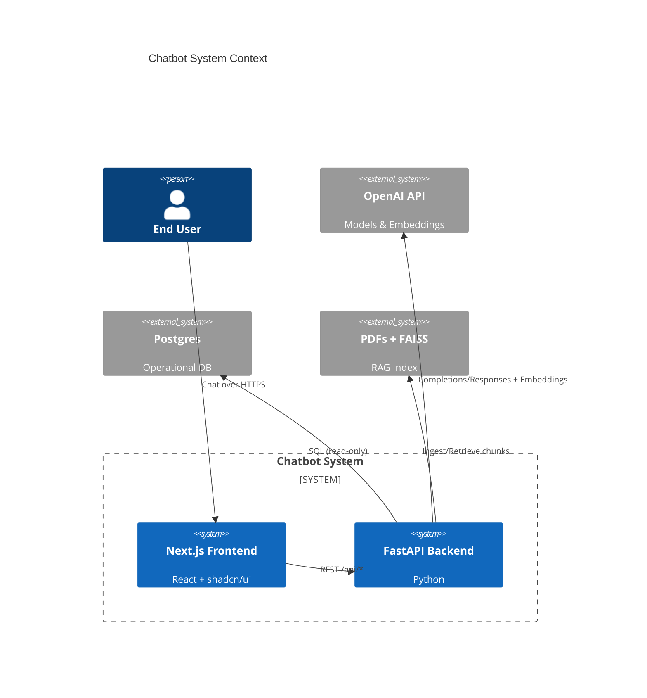
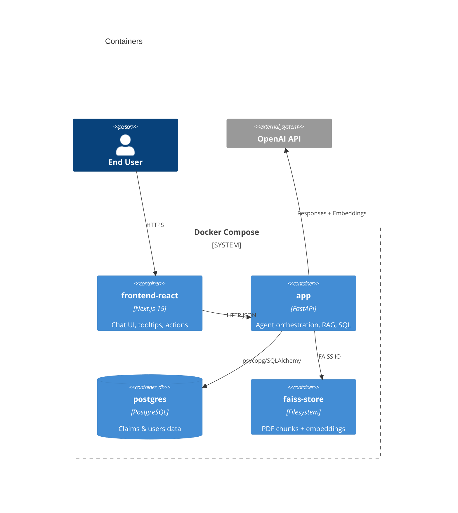
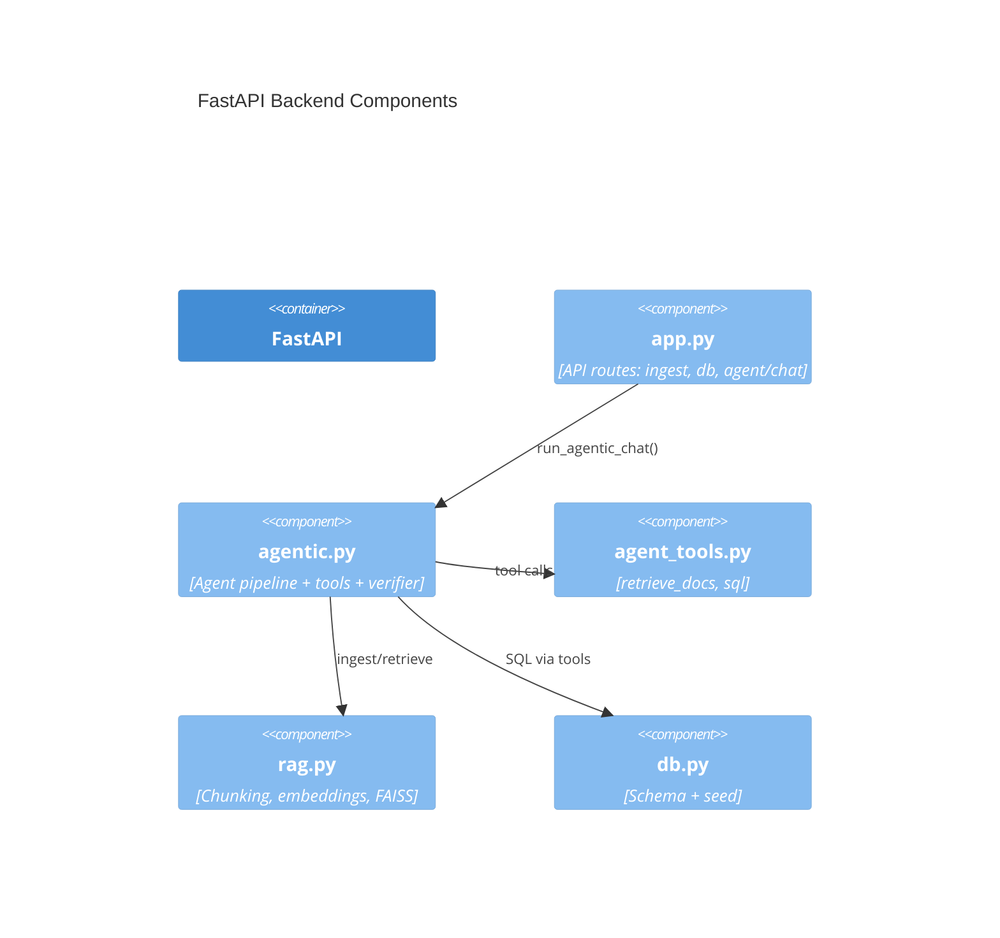
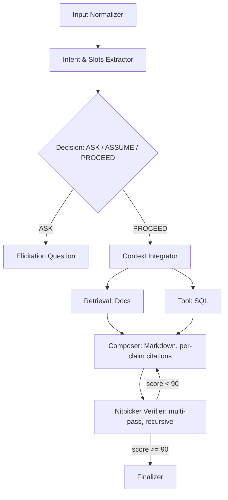
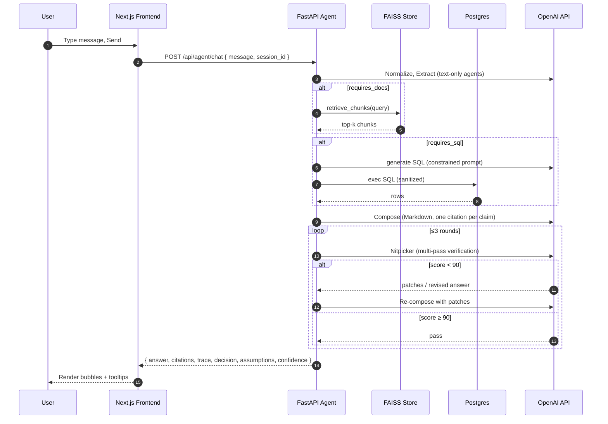
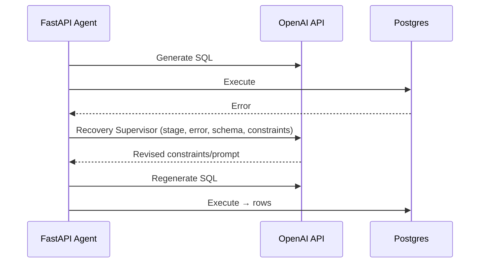

## PDF RAG + Agentic Chatbot (FastAPI + Next.js + OpenAI Agents)

### What this repo provides

- RAG over PDFs in `docs/` using FAISS and `text-embedding-3-large`
- Agentic chat pipeline (normalize → extract → decide → retrieve/tools → compose → verify → finalize)
- SQL tool over Postgres with strict guidance and sanitization
- Nitpicker verifier: multi-pass factuality/citation checker with recursive improvements
- Next.js (shadcn/ui + Radix) frontend with ChatGPT-like UI, streaming-ready, in-bubble citation tooltips
- Docker Compose environment: Postgres, FastAPI backend, Next.js frontend (optional MCP servers)

---

### Quick start (Docker Compose)

1) Prereqs: Docker Desktop 4.29+, Node 20+, Make (optional)
2) Configure environment

- Create `.env` in repo root:

```
OPENAI_API_KEY=sk-...
# Optional overrides
OPENAI_BASE_URL=
CHAT_MODEL=gpt-5
EMBEDDING_MODEL=text-embedding-3-large
```

3) Build and run

```
COMPOSE_BAKE=true docker compose up -d --build --force-recreate
```

4) Open the app

- Frontend (Next.js): http://localhost:3000
- Backend (FastAPI): http://localhost:8000

5) From the UI

- Ingest PDFs: Ingest → indexes `docs/*.pdf` into FAISS
- Init DB: creates schema
- Seed DB: inserts demo rows
- Chat: ask questions; use citations on hover in messages

Notes

- In Docker, the frontend talks to FastAPI using `NEXT_PUBLIC_FASTAPI_EXTERNAL_BASE` baked in the image.
- For macOS Docker, the backend origin inside the browser defaults to `http://host.docker.internal:8000`.

---

### Local development

Backend

```
uv python install 3.13
uv sync --all-extras
uv run --python 3.13 python main.py --host 0.0.0.0 --port 8000
```

Frontend

```
cd frontend-react
npm ci
npm run dev
```

Open http://localhost:3000 and ensure `NEXT_PUBLIC_FASTAPI_EXTERNAL_BASE=http://localhost:8000` for local dev.

---

### Endpoints (FastAPI)

- POST `/api/ingest` → { chunks_indexed }
- POST `/api/db/init` → { status }
- POST `/api/db/seed` → { status }
- POST `/api/agent/chat` → {
  answer, trace, citations, session_id, decision, assumptions, confidence
  }

Citations

- type `doc`: { tag, source, chunk_index, score, text }
- type `sql`: { tag, query, rows }

---

### Frontend UX highlights

- Messages render as Markdown; `[D1]/[S1]` tokens become hover-tooltips with full text/SQL
- Per-message citations: each assistant message carries its own evidence; New Chat resets state
- Dark theme; chat bubbles left/right; Shift+Enter = newline, Enter = send

---

### Data & DB

- PDFs in `docs/` are chunked using a semantic-ish recursive chunker with heading awareness
- FAISS index and metadata are stored under `data/` (gitignored)
- Postgres tables (abridged): `car_catalog`, `users`, `warranty_claims`, `sales_pipeline`
  - Proper PK/FK and helpful indexes (see `backend/agentic.py` schema block)

---

### Mermaid diagrams

#### C4 Level 1 — System Context



#### C4 Level 2 — Container



#### C4 Level 3 — Components (Backend)



#### C4 Level 4 — Code-Level (Agent Stages)



#### Sequence — Typical doc+SQL turn



#### Sequence — Tool failure with recovery



---

### Implementation details

- Citations: backend returns full text for doc citations; front-end renders `[Dx]/[Sx]` tokens as hover-tooltips per message
- SQL sanitation: code-fence stripping and percent escaping for psycopg
- Token limits: embeddings batched, long chunks truncated before embed; doc tool still returns full text for UX
- Session memory: short in-process history keyed by `session_id`

---

### Troubleshooting

- Frontend build warnings (unused vars in API routes) are safe; strict `any` is removed in components
- If frontend can’t reach backend in Docker, ensure `NEXT_PUBLIC_FASTAPI_EXTERNAL_BASE` resolves to FastAPI from the browser (macOS: `http://host.docker.internal:8000`)
- If embeddings fail with context length, confirm PDFs aren’t gigantic and re-run Ingest

---

### License

MIT
