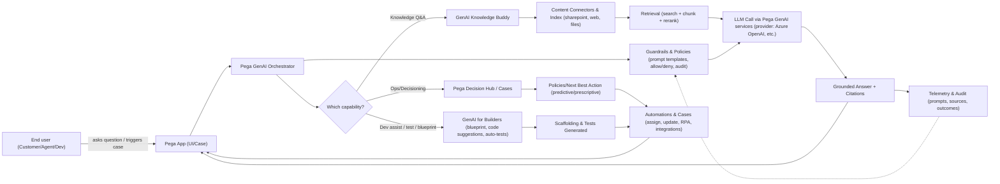

```mermaid
flowchart LR
    A["End user (Customer/Agent/Dev)"] -->|asks question / triggers case| B["Pega App (UI/Case)"]
    B --> C["Pega GenAI Orchestrator"]
    C --> D["Guardrails & Policies (prompt templates, allow/deny, audit)"]
    C --> E{"Which capability?"}
    E -->|Knowledge Q&A| F["GenAI Knowledge Buddy"]
    E -->|Dev assist / test / blueprint| G["GenAI for Builders (blueprint, code suggestions, auto-tests)"]
    E -->|Ops/Decisioning| H["Pega Decision Hub / Cases"]

    %% Knowledge Buddy (RAG) path
    F --> I["Content Connectors & Index (sharepoint, web, files)"]
    I --> J["Retrieval (search + chunk + rerank)"]
    J --> K["LLM Call via Pega GenAI services (provider: Azure OpenAI, etc.)"]
    D --> K
    K --> L[Grounded Answer + Citations]
    L --> B
    L --> M["Telemetry & Audit (prompts, sources, outcomes)"]

    %% Decision/Action path
    H --> N["Policies/Next Best Action (predictive/prescriptive)"]
    N --> O["Automations & Cases (assign, update, RPA, integrations)"]
    O --> B

    %% Dev path
    G --> P[Scaffolding & Tests Generated]
    P --> O
    M -.-> D
```